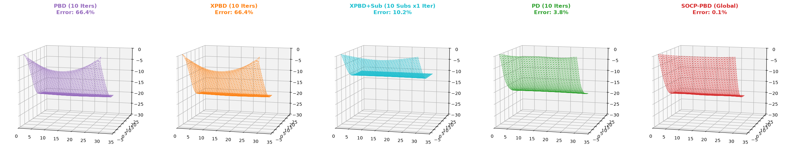
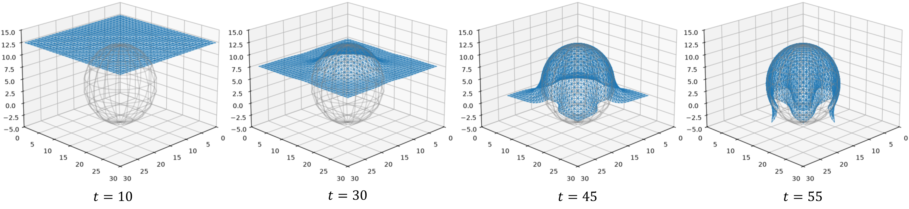
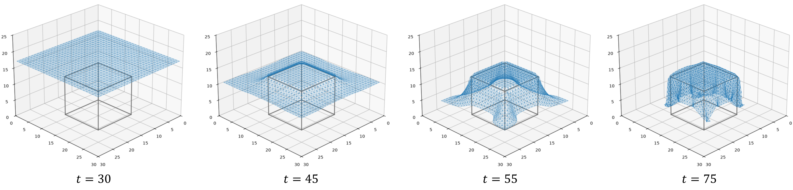
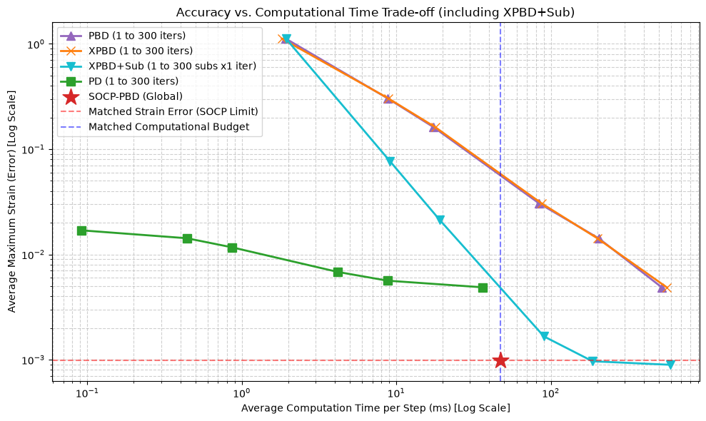
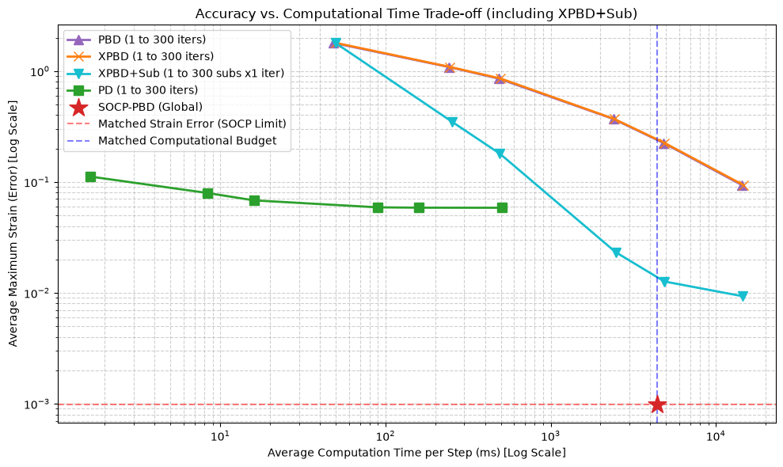

# SOCP-PBD

**SOCP-PBD: Suppressing Slack in Position-Based Cloth Simulation via Second-Order Cone Programming**

This repository contains the Python implementation of **SOCP-PBD**, a novel physics simulation method for nearly inextensible cloth.

## Overview
While Position-Based Dynamics (PBD) is widely used for deformable object simulation due to its simplicity and speed, it inherently suffers from visually undesirable "slack" and stretching artifacts, especially near anchored boundary conditions. 

SOCP-PBD addresses this issue by formulating the post-prediction constraint enforcement as a global **Second-Order Cone Programming (SOCP)** problem. By globally optimizing node positions, our method strictly enforces upper bounds on edge lengths. This effectively suppresses artificial stretching while permitting the natural compression required for cloth folding.

## Features
* **Anti-Stretching Constraint:** Globally resolves distance constraints using SOCP to prevent macroscopic slack.
* **Physics Extensions:** Supports Isometric Bending Model (IBM), XPBD-based self-collision handling, and approximate friction.
* **Readable Implementation:** Built purely in Python using `cvxpy` for easy understanding, testing, and algorithmic extension.

Snapshots of a sagging test for a high-resolution 30x30 mesh. The four on the right are existing methods (PBD, XPBD, XPBD+substepping, PD) and are included for comparison. In SOCP-PBD, on the far right, there is no sagging at the top edge.

The cloth behavior when dropped onto a spherical object.

The cloth behavior when dropped onto a cube-like object.

The trade-off curves for a low-resolution (10x10) mesh and a high-resolution (50x50) mesh. In the 10x10 scenario (left), heavily iterated local methods (PBD, XPBD, and XPBD+substepping), can eventually approach the accuracy limit of SOCP, albeit at a drastically higher computational cost.
However, the 50x50 scenario (right) exposes the absolute limitations of local constraint projections

## Requirements
The core optimization relies on [CVXPY](https://www.cvxpy.org/) and the [Clarabel](https://clarabel.org/stable/) interior-point solver.

* Python 3.8+
* `numpy`
* `scipy`
* `matplotlib`
* `cvxpy`
* `clarabel`

License
This project is licensed under the MIT License.
